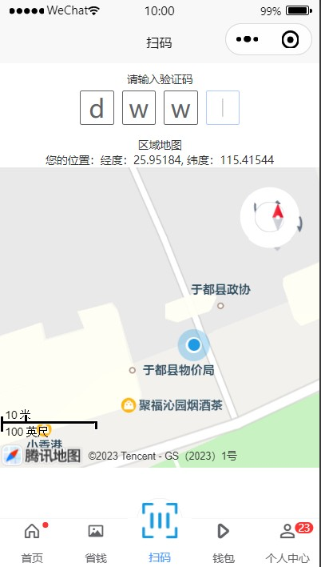
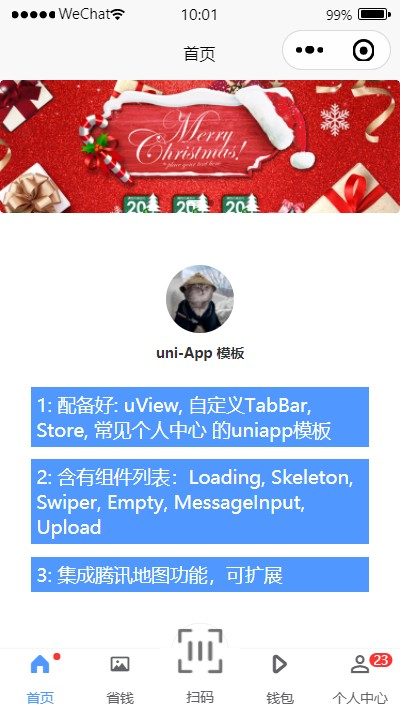
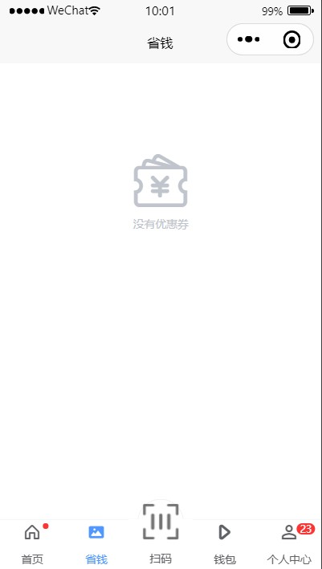
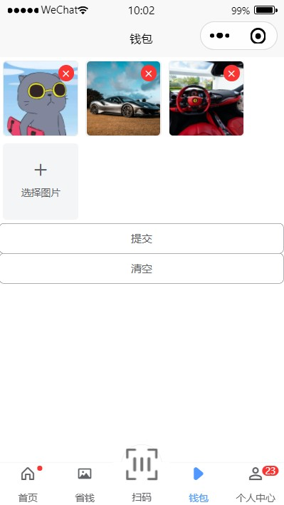
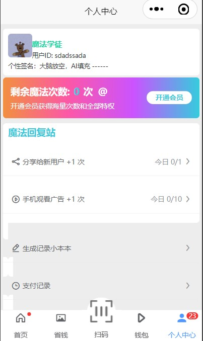

# uniapp-template
> 一个简洁的uniapp模板

## 功能
- [x] 已配备: uView, 自定义TabBar, Store, 常见个人中心 的uniapp模板 --- ✨✨
- [x] 含有组件：Loading, Skeleton, Swiper, Empty, MessageInput, Upload, --- 🎉🎉
- [x] 集成腾讯地图功能，可扩展, --- 🌹🌹

## 预览
- map

- home

- coupon

- upload

- user

## 使用指南
> clone 项目 -> HBuilder 打开 -> 修改wx appid -> 编译或运行到H5或者微信小程序。  
